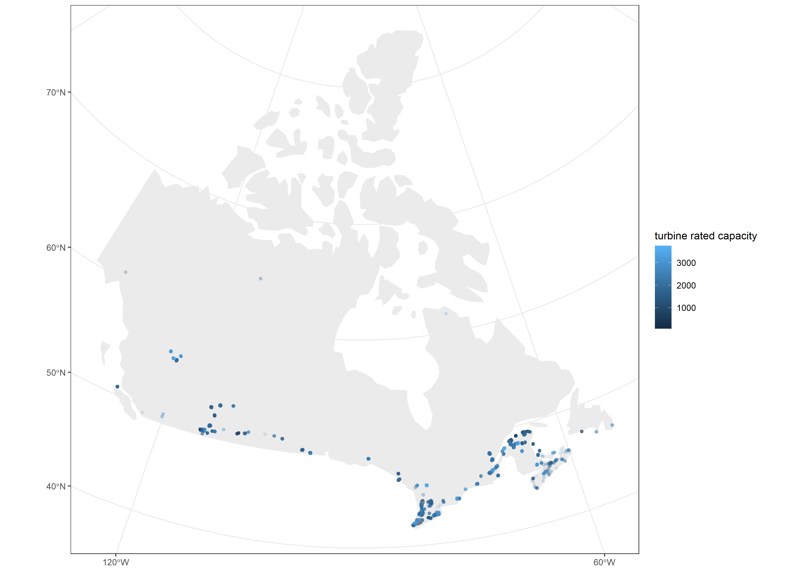

# Wind turbines in Canada 

This data set is a compilation of data on wind turbines in Canada. The plot below show the a breakdown of the total number of turbines per province. The provinces leading in the installation of wind turbines for power generation are Ontario, Quebec and Alberta 


Of the installed capacity, the largest number of turbines have a capacity of 2000 kW


## Where are the wind turbines installed?
Being able to visualize the locations of the wind turbines can be useful. The first map shows all the turbines across Canada plotted using the geom_sf function in ggplot

````
#Map all Canadian wind turbines
windturbine_sf<-
  st_as_sf(wind_turbine, coords = c("longitude","latitude"), 
          crs = "+proj=longlat +datum=WGS84 +no_defs") %>% 
  st_transform(crs = "+proj=lcc +lon_0=-90 +lat_1=33 +lat_2=45")

sf_canada <-
  rnaturalearth::ne_countries(scale = 110, country = "Canada", 
                              returnclass = "sf") %>% 
  st_transform(crs = st_crs(windturbine_sf))

canadaturbinemap=ggplot(sf_canada) +
  geom_sf(color = NA, fill = "grey92") +
  geom_sf(data = windturbine_sf, mapping=aes(size=turbines, color=turbine_rated_capacity_k_w), alpha = .1, 
          size = 2, shape = 20, fill = NA)+theme_bw()+labs(color="turbine rated capacity")

ggsave("canadaturbinemap.png",width = 297,height = 210,units = c("mm"),dpi = 300)


````



An interactive map can also be created using tmap

````
#Map Quebec turbines
quebecturbines<-filter(wind_turbine,province_territory == "Quebec")

quebecturbine_sf<-
  st_as_sf(quebecturbines, coords = c("longitude","latitude"), 
           crs = "+proj=longlat +datum=WGS84 +no_defs") %>% 
  st_transform(crs = "+proj=lcc +lon_0=-90 +lat_1=33 +lat_2=45")

tm_basemap("OpenStreetMap")+
  tm_shape(quebecturbine_sf,bbox="Canada")+tm_dots("total_project_capacity_mw",n=6,popup.vars=c("Project Name"="project_name","Total project capacity(MW)"="total_project_capacity_mw"),palette="PuRd")

````
Below is a screenshot of the resulting map
<iframe src="quebecturbinemap.html" frameborder="0" width="100%" height="300px"></iframe>

<iframe src="/files/html/posts/predoc_map.html" height="600px" width="100%" style="border:none;"></iframe>


    

