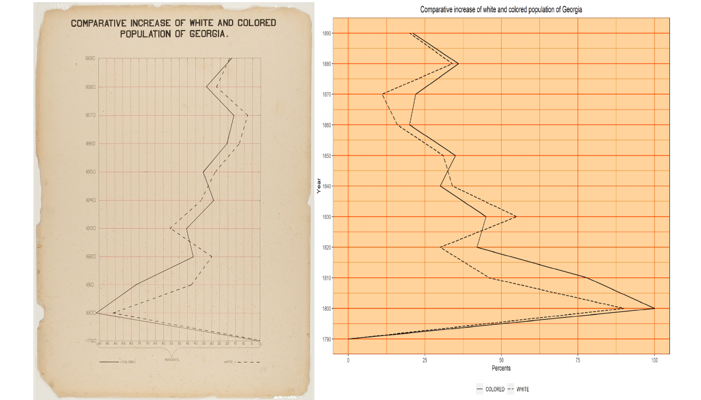
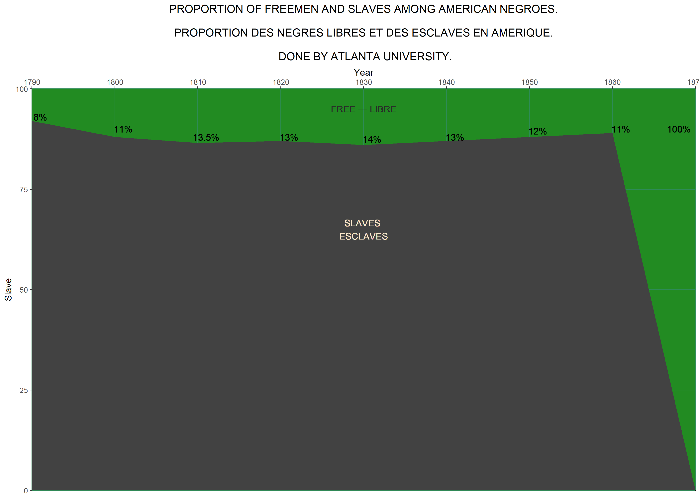

# Dubois Challenge 
### challenge 01: Comparative Increase of White and Colored Population in Georgia

The Dubois challenge was all about recreating plots created in the 1800's by W.E.B Dubois using modern tools. The original illustrations were hand-drawn. In the figure below see the original from 1900 on the left and figure created in R on the right. 

### challenge 04: Proportion of Freeman and Slaves Among American Negroes

Another recreation of W.E.B Dubois's data visualisations, the original illustration was created with the help of students at Atlanta University where he was a 
Professor of Economics and History. Dubois used his had drawn visualisations to show the oppression of black people in the US (see the TidyTuesday repository for original figures).The steep drop off at 1860 coincides with seismic shifts in the US at that time, the American civil war breaking out in 1861, and certain politicians putting pressure on President Lincoln to emancipate the slaves, and later on the Emancipation proclamation issued on January 1 1863. The Emancipation Proclamation meant that slaves who managed to escape their masters became 'legally free'. [ref: Wikipedia-Slavery in the US](https://en.wikipedia.org/wiki/Slavery_in_the_United_States#1790_to_1860)

I thought the use of stark black in his original plot was striking because it does make the image grim, very much like the subjects he dealt with. 

