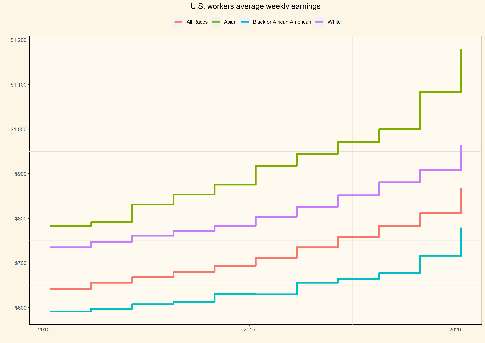

## U.S. worker weekly median earnings

For this Tidy Tuesday, data is from the US Bureau of Labor Statistics, a dataset showing the weekly median earnings broken down by race, gender and age group over time. This plot shows the weekly median earnings for all workers over the past ten years. Weekly earnings for each group have been increasing but Asian workers have seen the biggest rise in incomes



### What is the wage gap between men and women? 
The gender pay gap between men and women is an established fact. To explore this difference in this data set, I created a subset from the original data set, and added a new column using the mutate() function in order to 'Hispanic or Latino' as a distinct race category. The categories in the original data set can be confusing because the column 'race' contains Black, Asian, White and All races; whereas the column "ethnic origin" contains the subset 'Hispanic or Latino'. Using the case_when function if race is equal to "All races" AND "ethnic origin" is equal to 'Hispanic or Latino', then in the new column "race_unclass", that becomes Hispanic or Latino.  

````
#Calculating the pay gap between men and women 
earn_df2<- earn %>% 
  select(sex,race,ethnic_origin,year,median_weekly_earn) %>% 
  mutate(race_unclass = case_when(race == "Black or African American" ~ "Black",
                          race == "All Races" & ethnic_origin == "Hispanic or Latino" ~ "Hispanic\nor Latino",
                          TRUE ~ race))
````
From the new data frame, calculate the difference between average earnings for men and women.
````
wagesbygender<-earn_df2 %>% 
  mutate(race_unclass = factor(race_unclass, levels = c("Black","Hispanic\nor Latino","White","Asian"))) %>%
  group_by(race_unclass,sex,year) %>%
  summarize(earn = mean(median_weekly_earn)) %>%
  filter(!sex == "Both Sexes") %>%
  pivot_wider(names_from = sex, values_from =earn) %>%
  mutate(diff= Men-Women)

wagesbygender<-na.omit(wagesbygender)

wagediffplot=ggplot(wagesbygender,aes(x=year,y=diff,fill=race_unclass,color=race_unclass))+
  geom_line()+ theme_classic()+
  geom_area()+facet_grid(~race_unclass)+
  scale_y_continuous(n.breaks=10,labels=scales::dollar_format())+
  theme(axis.text.x = element_text(angle=50, hjust=1))+
  ylab("")+theme(legend.position='none')
  
ggsave("wagediffplot.png",width = 297,height = 210,units = c("mm"),dpi = 300)

````
From the plot below it is evident that across all ethnic groups men earn more than women, but once again the gender pay gap is greatest among Asians


