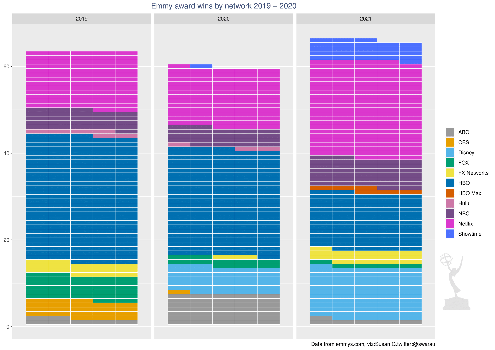

# Emmy awards 

## Introduction: 
An Emmy Award, or simply Emmy, is a trophy presented at one of the numerous annual American events or competitions that each recognize achievements in a particular sector of the television industry. The Emmy is considered one of the four major entertainment awards in the United States, the others being the Grammy (for music), the Oscar (Academy Award) (for film), and the Tony (for theatre). The two events that receive the most media coverage are the Primetime Emmy Awards and the Daytime Emmy Awards, which recognize outstanding work in American primetime and daytime entertainment programming, respectively. 

### Experimenting with waffle plots 
I wanted to experiment with waffle plot for this data set. Waffle plots, sometimes referred to as square pie charts, can be useful in presenting parts of a whole for categorical data. 

The number of distribution(mainly TV) networks represented at the Emmy awards are 199 going by the 'distributor' column in this dataset. For purposes of clarity, I picked out a few major TV and streaming platforms: 

````
library(tidyverse)
library(waffle)
library(dplyr)
library(RColorBrewer)
library(magick)

#load data
nominees <- read.csv("~/GitHub/TidyTuesday/2021-09-21/nominees.csv")

#convert columns to factor 
cols2factor <-c('type','distributor','producer')
nominees[,cols2factor]<-lapply(nominees[,cols2factor],as.factor)

#Winners by network
winners <- nominees %>%
  select(type,category,title,producer,distributor,year) %>%
  filter(distributor %in% c("ABC","NBC","CBS","FOX","FX Networks","Netflix","Hulu","Showtime","HBO","HBO Max","Disney+")) %>%
  filter(type == "Winner") %>%
  filter(year >= 2019) %>%
  group_by(distributor,year) %>%
  count(title)

````
For this plot I decided to use a color blind friendly palette, however I also had to add three extra colors because the variables are more than the 8 present in the palette. I also read in the emmy awards logo to use in the plot.  

````
# Color blind friendly palette with grey: first 8 colors found online, 
# had to add 3 more to fit data
cbp1 <- c("#999999", "#E69F00", "#56B4E9", "#009E73",
          "#F0E442", "#0072B2", "#D55E00", "#CC79A7",
          "#744D88","#DA38CD","#4D72FF")

#Read in the Emmy awards logo 
emmylogo <- image_read("~/GitHub/TidyTuesday/2021-09-21/emmyawardlogo.png")

````
The first step is to create the base plot, this does not include the logo: 

````
#Create your base plot
myplot = ggplot(data = winners, aes(fill = distributor,values = n)) + 
  geom_waffle(color = 'white',size = 0.25, n_rows = 5, flip = TRUE)+
    scale_fill_manual(values = cbp1) +
    facet_wrap(~year) +
    scale_x_discrete() +
    labs(title = "Emmy award wins by network 2019 - 2021", 
    caption = "Data from emmys.com, viz:Susan G.twitter:@swarau")+
    theme(plot.title = element_text(color = "#3F5079", hjust = 0.5))+
    theme(legend.title = element_blank())

````
The logo is added on top of the base plot. 

````
myplot #base plot here 

#this code adds the logo on top of your base plot, x and y values position the logo
grid::grid.raster(emmylogo, x = 0.95, y = 0.28, just = c('right', 'top'), width = unit(0.85, 'inches'))

````



