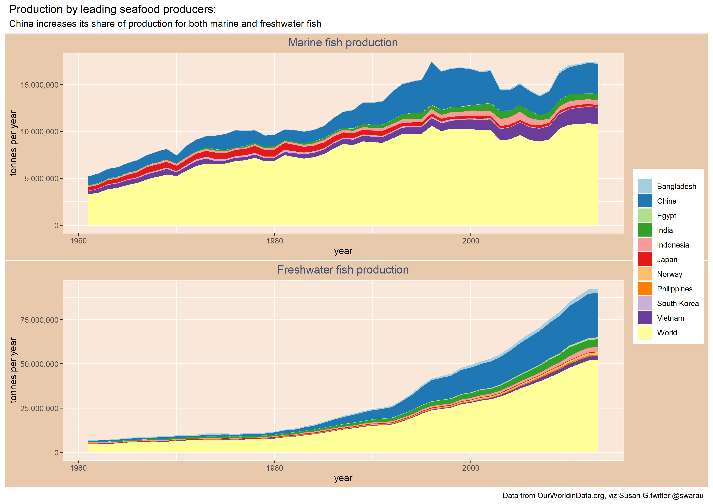

## Global seafood production 

This data set is from OurWorldinData and it was hard to pick what to focus because one could ask so many different questions: 

For this visualization I decided to pick the known leading seafood producing countries and plot the evolution over the years of
marine and freshwater fish production. 

First things, first load the packages, your data and clean the column names, it is easier when all names are in the same case. `janitor` puts them in small case by default: 

```
library(tidyverse)
library(countrycode)
library(janitor)
library(RColorBrewer)
library(scales)
library(gridExtra)
library(patchwork)

#load data 
production <- readr::read_csv('https://raw.githubusercontent.com/rfordatascience/tidytuesday/master/data/2021/2021-10-12/seafood-and-fish-production-thousand-tonnes.csv')

#make all column names consistent
production <-janitor::clean_names(production)

```
I filtered out data from the big 10 countries, plus 'World' which aggregates the global production for each category: marine and freshwater. After filtering, 
generate the plots

```
#large seafood producers
bigproducer <- production %>%
  filter(entity %in% c("Bangladesh","China","Egypt","India","Indonesia","Philippines","Norway","Japan","South Korea","Vietnam","World"))

#Marine fish
p1 = ggplot(bigproducer) +
  geom_area(aes(x = year, y = commodity_balances_livestock_and_fish_primary_equivalent_marine_fish_other_2764_production_5510_tonnes,fill = entity))+
  scale_fill_brewer(palette = "Paired")+
  scale_y_continuous(labels = comma)+
  ylab("tonnes per year")+
  labs(title = "Marine fish production")+
  theme(plot.title = element_text(color = "#3F5079", hjust = 0.5))+
  theme(legend.title = element_blank())+
  theme(plot.background = element_rect(fill = "#E9C9AC"))+
  theme(panel.background = element_rect(fill = "#F9E8D9",color = "#FFF7EB"))


p2 = ggplot(bigproducer) +
  geom_area(aes(x = year, y = commodity_balances_livestock_and_fish_primary_equivalent_freshwater_fish_2761_production_5510_tonnes, fill = entity))+
  scale_fill_brewer(palette = "Paired")+
  scale_y_continuous(labels = comma)+
  ylab("tonnes per year")+
  labs(title = "Freshwater fish production")+
  theme(plot.title = element_text(color = "#3F5079", hjust = 0.5))+
  theme(legend.title = element_blank())+
  theme(plot.background = element_rect(fill = "#E9C9AC"))+
  theme(panel.background = element_rect(fill = "#F9E8D9",color = "#FFF7EB"))

```
Finally arrange the plots as one image and save the resulting file: 

````
patchwork <- p1 + p2 + plot_layout(ncol = 1, nrow = 2, guides = "collect")

patchwork + plot_annotation(
  title = 'Production by leading seafood producers:',
  subtitle = 'China increases its share of production for both marine and freshwater fish',
  caption = 'Data from OurWorldinData.org, viz:Susan G.twitter:@swarau')

ggsave("seafoodproduction.png",width = 297,height = 210,units = c("mm"),dpi = 300)

````


